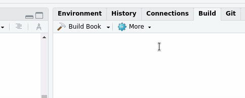

# Plantilla memoria proyectos URJC con R Markdown

Este proyecto de RStudio proporciona una plantilla para crear una memoria de TFG o TFM de la URJC, usando [R Makdown](https://rmarkdown.rstudio.com/) y [LaTeX](https://es.wikipedia.org/wiki/LaTeX). La misma plantilla puede ser fácilmente adaptada para la redacción y publicación de una tesis doctoral en URJC.

La base es una [plantilla para proyectos URJC con XeLaTeX](https://github.com/glimmerphoenix/plantilla-memoria-TFG-TFM) publicada en GitHub, así como en un repositorio del GitLab de la [OfiLibre URJC](https://ofilibre.gitlab.io/).

La principal ventaja que ofrece esta versión es que te permite trabajar directamente en R/RStudio para realizar, simultáneamente, la parte técnica de tu proyecto y la redacción de la memoria. Con eso se ahorra mucho tiempo y se evita duplicar esfuerzos (por ejemplo, guardando gráficas o resultados para incorporarlos al documento de la memoria, formatearlos, etc.). Mediante esta plantilla, todo el proceso queda automatizado a través de las funciones de R Markdown y el [paquete bookdown](https://pkgs.rstudio.com/bookdown/), entre otros. Esto también es posible gracias a [Pandoc](https://pandoc.org/), el conversor universal de documentos, que se encarga de todo el trabajo pesado de traducción del contenido Markdown a PDF.

## Instrucciones de uso
Lo más sencillo es hacer un *fork* de este repositorio para obtener tu propia copia, sobre la que ya podrás trabajar directamente. Es
conveniente que renombres el repositorio de tu copia con un identificador apropiado, por ejemplo `TFG-NombreApellidos` o 
`TFM-NombreApellidos`. Por último, clona el repositorio en tu máquina local y abre el proyecto en RStudio para comenzar a trabajar.

Puedes consultar información adicional en estos enlaces:
  * [Introducción a R Markdown](https://rmarkdown.rstudio.com/lesson-1.html).
  * [Tutoriales sobre R Markdown](https://rmarkdown.rstudio.com/articles.html).
  * [R Markdown: The Definitive Guide](https://bookdown.org/yihui/rmarkdown/).
  * [R Markdown Cookbook](https://bookdown.org/yihui/rmarkdown-cookbook/).
  * [bookdown: Authoring Books and Technical Documents with R Markdown](https://bookdown.org/yihui/bookdown/).

### Requisitos software previos
En el directorio [`/fonts`](./fonts) encontrarás los archivos de tipografías necesarias para instalarlas en tu equipo, en caso de que aún no las tengas.

Si quieres compilar la memoria utilizando esta plantilla en tu propio sistema, necesitas tener primero instalados los programas necesarios.

* Una **distribución completa de LaTeX**, por ejemplo [Tex Live](https://www.tug.org/texlive/acquire-netinstall.html). Si usas
  Linux, busca en el gestor de paquetes de tu distribución los paquetes que necesitas instalar.
* La plantilla incorpora el [**paquete `minted`**](https://ctan.org/pkg/minted), para resaltado de sintaxis de fragmentos de código. Para que funcione, debes tener instalado Python, junto con el paquete [Pygments](https://pypi.org/project/Pygments/).
* Además, recuerda que cualquier fuente tipográfica que quieras utilizar en el documento debe ser una fuente OpenType o TrueType
  compatible y estar previamente instalada en tu sistema, para que se pueda insertar en el documento. Las fuentes se pueden configurar fácilmente en las opciones del preámbulo del archivo `index.Rmd`. 
  
  Inicialmente, las fuentes usadas son:
    - mainfont: "TeX Gyre Pagella" [Descarga](https://www.1001fonts.com/tex-gyre-pagella-font.html);
    - sansfont: "Lato", de [Google Fonts](https://fonts.google.com/specimen/Lato);
    - monofont: "Source Code Pro", de [Google Fonts](https://fonts.google.com/specimen/Source+Code+Pro);
    - mathfont: "TeX Gyre Pagella Math" [Descarga, licencia](http://www.gust.org.pl/projects/e-foundry/tg-math/download/index_html#Pagella_Math);
    - fuente para títulos: "Montserrat", de [Google Fonts](https://fonts.google.com/specimen/Montserrat).

Todas estas fuentes están disponibles públicamente, con licencia libre. 

### Compilación de la memoria PDF

Una vez instalados todos los requisitos previos, puedes compilar el documento pulsando el botón *Build Book* de la pestaña *Build* del panel *Environment/History*, tal y como muestra la siguiente animación.

## Características principales
Esta plantilla está preparada para generar tu memoria en formato PDF utilizando [XeTeX](https://en.wikipedia.org/wiki/XeTeX), un motor de tipografía que se invoca 
mediante el [comando `xelatex`](https://tex.stackexchange.com/questions/296616/questions-regarding-the-distinction-between-xetex-and-xelatex-and-how-they-relat). XeTeX está instalado en la mayoría de distribuciones LaTeX modernas, tales como 
[TeX Live](https://www.tug.org/texlive/). Este motor incorpora algunas características novedosas:

* Usa por defecto codificación UTF-8.
* Soporta fuentes [Open Type](https://en.wikipedia.org/wiki/OpenType) instaladas en tu sistema.
* Permite usar [fuentes Unicode con características matemáticas especiales](https://tex.stackexchange.com/questions/43813/what-math-fonts-are-available-that-work-in-xelatex), 
  como [Asana Math](https://en.wikipedia.org/wiki/Asana-Math) o TeX Gyre Pagella Math.
* Permite utilizar iconos representados como fuentes tipográficas, como [Font Awesome](https://fontawesome.com/), instalados en el sistema.
* Utiliza [`polyglossia`](https://ctan.org/pkg/polyglossia), un paquete de reglas tipográficas y traducción de términos a lenguas
  diferentes del inglés, alternativo a [`babel`](https://ctan.org/pkg/babel) para XeLaTeX y LuaTeX y mucho más potente.
  
Además, la plantilla utiliza [BibLaTeX](https://www.ctan.org/pkg/biblatex) como paquete de gestión de referencias bibliográficas,
en sustitución del tradicional [BibTeX](https://www.ctan.org/pkg/bibtex). BibLaTeX, junto con el gestor de backend 
[`biber`](https://www.ctan.org/pkg/biber), soporta codificación UTF-8 de forma nativa y posee muchas características potentes para 
manejar referencias en documentos.

## Informes de error y peticiones de mejoras

Por favor, utiliza el sistema de [seguimiento de errores del proyecto](https://github.com/glimmerphoenix/plantilla-memoria-rmd-URJC/issues) (*Issues*, en el menú superior de esta página), si quieres reportar algún error que hayas encontrado o solicitar nuevas funciones o mejoras.
